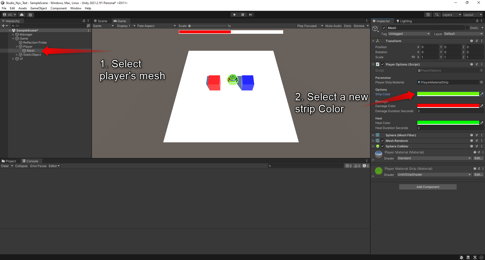
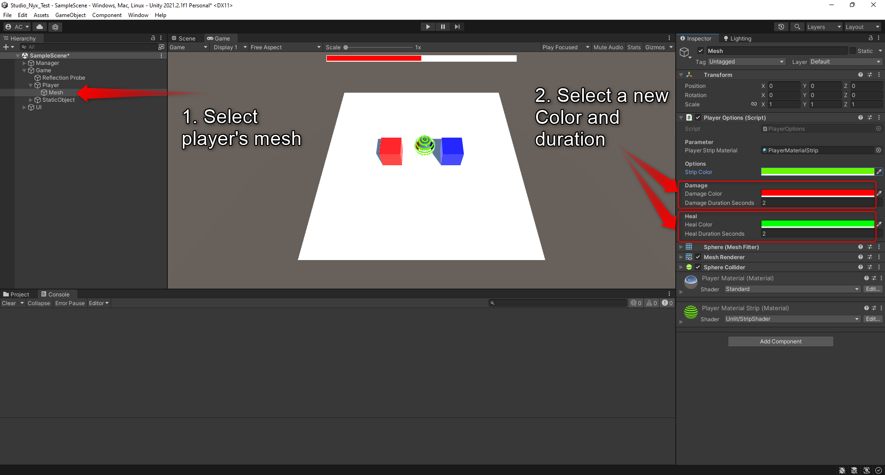

# Studio Nyx Test

## Informations
 
 Unity Version : 2021.2.1f
 
 ## Documentation
 
In step 5, I need to add player color and make it possible to change it in inspector view.
This is a screenshot of Unity to show you where it's possible to modify the player color on the inspector view.

In step 9-10, I need to add visual feedback for the user and make it possible to change color and duration in inspector view.
This is a screenshot of Unity to show you where it's possible to modify the color and duration for Health and Damage on the inspector view.

